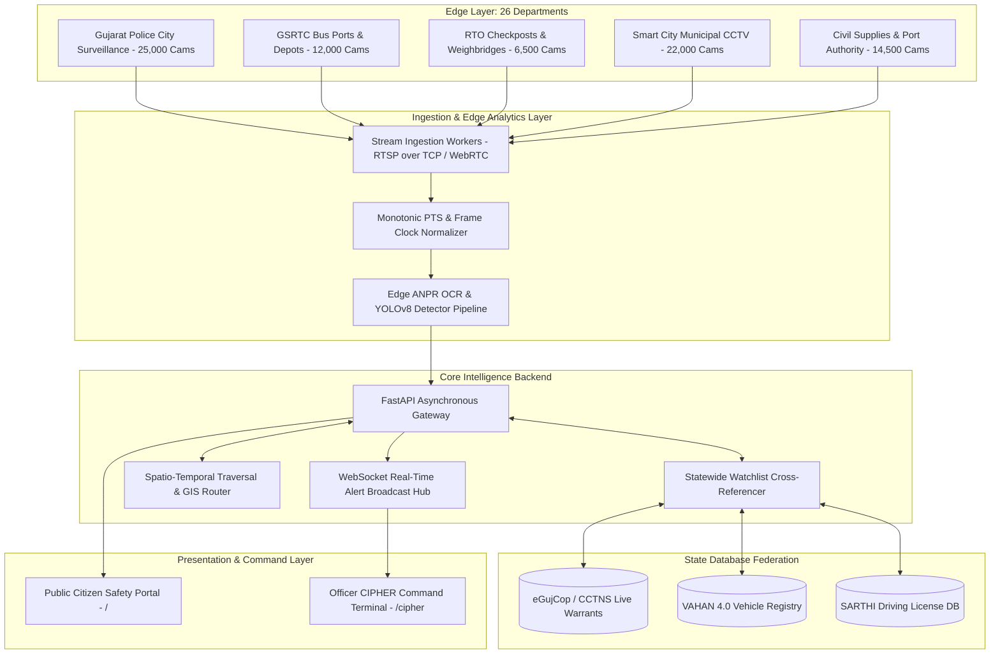
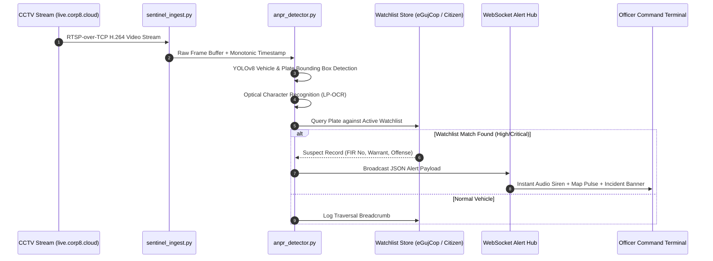

# 🏛️ SENTINEL Architecture & Technical Blueprint
### Gujarat Police Statewide Video Management & AI Intelligence Platform (80,000+ CCTV Grid)

---

## 1. Executive Architecture Summary
**SENTINEL** is a high-throughput, vendor-neutral surveillance orchestration and automated vehicle intelligence platform designed to federate **80,000+ IP/RTSP cameras across 26 Gujarat Government Departments** (Police, GSRTC, RTO, Civil Supplies, Municipal Corporations, Health, Ports, and Highways) into a unified spatio-temporal intelligence fabric.

---

## 2. Core Architectural Principles

### 2.1. Zero-Hardware-Replacement Ingestion
* **Protocol Neutrality**: Ingests standard RTSP (`rtsp://`), RTMP, HLS, and WebRTC streams directly from disparate NVRs/VMS vendors (Hikvision, Dahua, CP Plus, Axis, Hanwha, Milestone, Genetec) without proprietary lock-in.
* **Network Efficiency**: Stream transcoding uses dynamic GOP (Group of Pictures) sizing with low-latency H.264/H.265 passthrough to conserve inter-departmental WAN bandwidth.

### 2.2. Spatio-Temporal Monotonic Timestamp Synchronization
* **The Problem**: Disparate departmental NVRs have unsynchronized hardware RTC clocks (clock drift up to ±15 minutes), making timeline reconstruction flawed.
* **The Solution**: SENTINEL's stream ingestion engine timestamps frames at the moment of packet arrival using a monotonic wall-clock (UTC+05:30 IST) calibrated via state NTP servers. Every detection is pinned to `(Latitude, Longitude, Camera_ID, Department_ID, Monotonic_Timestamp)`.

### 2.3. Dual-Layer Domain Separation
* **Public Citizen Surface (`/`)**: High-performance informational and intake portal providing emergency SOS hotlines (112, 1091, 1930, 1095), interactive e-Challan lookup, jurisdiction locators, and vehicle theft e-Intimations.
* **Officer CIPHER Command Terminal (`/cipher`)**: Protected law-enforcement console isolated behind session-token authentication (`Officier CIPHER`), featuring live GIS spatial tracking, 30-feed live cloud sandbox video wall, automated watchlist alerts, and historical traversal reconstruction.

---

## 3. High-Speed ANPR & AI Analytics Pipeline

---

## 4. Spatio-Temporal Vehicle Traversal Engine
When an investigating officer enters a target license plate:
1. **Chronological Node Query**: Scans historical detection logs across all 26 departments.
2. **Waypoints Ordering**: Sorts detection waypoints chronologically by monotonic timestamp.
3. **Speed & Plausibility Validation**: Calculates velocity between consecutive camera nodes ($v = \frac{\Delta d}{\Delta t}$). Flags impossible traversals ($v > 180\text{ km/h}$) as potential cloned plates.
4. **GIS Vector Polyline Generation**: Synthesizes intermediate route coordinates via state highway corridor vector graphs and renders an interactive path on Leaflet GIS.

---

## 5. Technology Stack

| Layer | Technology | Purpose |
| :--- | :--- | :--- |
| **Backend Framework** | FastAPI (Python 3.9+) | Asynchronous REST API, static asset routing, and WebSocket concurrency |
| **ASGI Web Server** | Uvicorn | Production-ready high-throughput asynchronous server |
| **Stream Engine** | OpenCV / PyAV / Requests | RTSP stream decoding, frame buffering, and network resilience |
| **Frontend Core** | Vanilla HTML5 / Modern ES6+ JavaScript | Zero-framework bloat, microsecond DOM rendering, maximum responsiveness |
| **Styling & Theme** | Modern Glassmorphism CSS3 | High-tech dark command center aesthetic with responsive flex/grid layouts |
| **GIS Mapping** | Leaflet.js | OpenStreetMap / CartoDB Dark Spatio-Temporal camera cluster visualization |
| **Audio Synthesis** | Web Audio API (`AudioContext`) | Realistic dual-frequency police alert wail siren synthesis |
